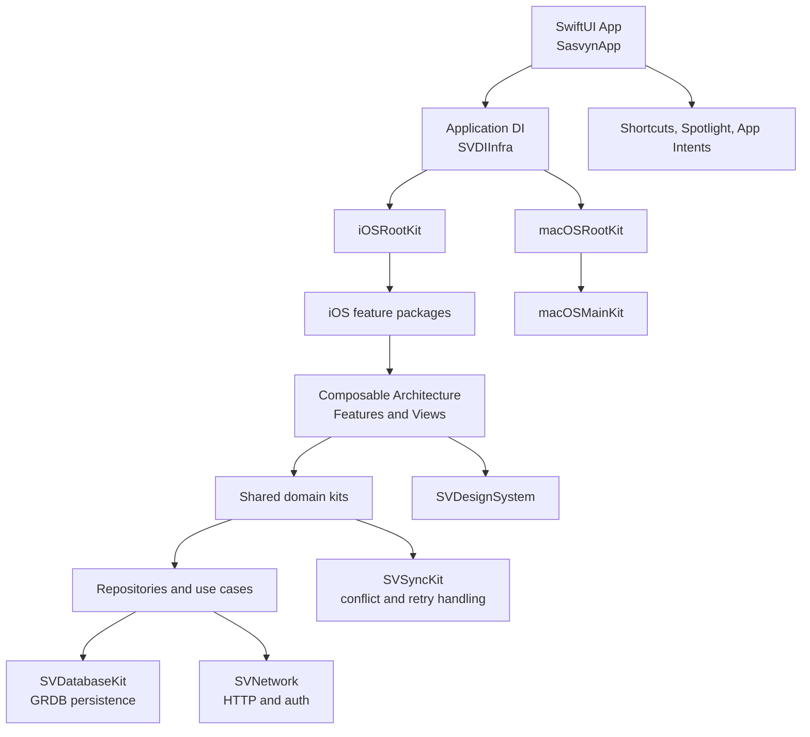

<div align="center">
	

	<h1>Sasvyn</h1>

	<p>A modular SwiftUI workspace for building, managing, presenting, and synchronizing a personal portfolio.</p>

	<p>
		
		
		
		
		
	</p>

	<p>
		<a href="#product-areas">Explore the product</a> ·
		<a href="#architecture">Understand the architecture</a> ·
		<a href="#getting-started">Run locally</a>
	</p>
</div>

<br>

<table>
	<tr>
		<td align="center" width="25%"><strong>Portfolio-first</strong><br><sub>Projects, experience, education, skills, and more</sub></td>
		<td align="center" width="25%"><strong>Native by design</strong><br><sub>SwiftUI experiences for iOS and macOS</sub></td>
		<td align="center" width="25%"><strong>Modular core</strong><br><sub>Small packages with focused responsibilities</sub></td>
		<td align="center" width="25%"><strong>Sync-ready</strong><br><sub>Local persistence and resilient synchronization</sub></td>
	</tr>
</table>

Sasvyn is an Apple-platform application for organizing the information that makes up a professional portfolio: projects, experience, education, skills, languages, documents, mockups, personal information, and social links. It is implemented as a Swift Package Manager-based modular monorepo and assembled into a SwiftUI application for iOS and macOS.

The repository is designed around small domain packages, platform-specific feature packages, reusable UI infrastructure, dependency injection, local persistence, remote networking, and a generic synchronization engine.

## Contents

- [Product Areas](#product-areas)
- [Architecture](#architecture)
- [Repository Layout](#repository-layout)
- [Package Catalog](#package-catalog)
- [Application Lifecycle](#application-lifecycle)
- [Data and Persistence](#data-and-persistence)
- [Networking and Synchronization](#networking-and-synchronization)
- [Platform Integrations](#platform-integrations)
- [Requirements](#requirements)
- [Getting Started](#getting-started)
- [Building](#building)
- [Testing](#testing)
- [Automation](#automation)
- [Configuration and Signing](#configuration-and-signing)
- [Project Status](#project-status)

## Product Areas

Sasvyn brings several portfolio workflows together in one application:

- **Home**: dashboard content, recent projects, quick actions, and portfolio creation entry points.
- **Portfolio**: featured portfolio presentation with project and experience sections.
- **Projects**: project metadata, descriptions, roles, app information, screenshots, skills, and screenshot ordering.
- **Experience**: work history, responsibilities, dates, and editing flows.
- **Education**: education records, grades, and education forms.
- **Skills**: categorized skills, grouped presentation, and skill editing.
- **Languages**: spoken languages, proficiency, selection, and editing.
- **Documents**: document categories, local files, document cards, and PDF previews.
- **Mockups**: device selection, image placement, presentation modes, and export-ready mockups.
- **Personal information**: name, date of birth, profile image, and synchronized account information.
- **Social links**: typed links for services such as GitHub, LinkedIn, Instagram, YouTube, X, Medium, Behance, Dribbble, and websites.
- **Settings**: appearance preferences and personal-information settings.

## Architecture

The project separates reusable domain behavior from platform presentation. Shared modules own data and business rules; iOS and macOS packages compose those capabilities into user-facing features.



### Architectural layers

Most shared domain packages follow the same boundaries:

```text
Domain/
	Entities       Value types and domain models
	Repositories   Repository contracts
	UseCases       Application operations
Data/
	Sources        Local and remote data sources
	Repositories   Concrete repository implementations
	DTOs           Network request and response models
Database/
	Records        Persisted database records
	Mappers        Record-to-domain conversion
	Migrations     Schema creation and evolution
DI/
	Clients        TCA dependency clients
	Containers     Dependency composition
Presentation/   Shared reusable views where applicable
```

The presentation packages use The Composable Architecture (TCA) for feature state, actions, reducers, navigation, and dependency access. Swift 6 language mode and `ApproachableConcurrency` are used throughout the package graph where configured.

## Repository Layout

```text
.
├── Sasvyn.xcodeproj/             Xcode application project and shared scheme
├── Sasvyn/                       Application target and local Swift packages
│   ├── App/                      SwiftUI, UIKit/AppKit, and scene entry points
│   ├── Modules/                  Shared domain, infrastructure, and UI packages
│   ├── iOS/                      iOS feature and composition packages
│   └── macOS/                    macOS feature and composition packages
├── SasvynTests/                  Application unit-test target
├── SasvynUITests/                Application UI-test target
├── SasvynShareExtension/         Share-extension localization scaffold
├── fastlane/                     Build lanes and signing configuration
├── Gemfile                       Ruby dependency definition for fastlane
├── ExportOptions.plist           Development export settings
└── README.md                     Project documentation
```

Each package normally contains a `Package.swift`, a `Sources` directory, a `Tests` directory, and a package-specific `Package.resolved` when external dependency resolution is committed for that package.

## Package Catalog

### Shared modules: `Sasvyn/Modules`

| Package | Responsibility |
| --- | --- |
| `AuthKit` | Apple Sign In authentication, auth session state, auth client, repository, and authentication use cases. |
| `SVAboutKit` | About/profile content, local persistence, repository, CRUD use cases, migration, and dependency registration. |
| `SVDatabaseKit` | GRDB-backed database abstraction, migrations, records, CRUD operations, filters, sorting, observation, database values, and schema builders. |
| `SVDesignSystem` | Shared SwiftUI controls and visual primitives including buttons, chips, lists, sections, date pickers, text editors, image viewers, web views, LaTeX rendering, colors, fonts, symbols, spacing, and empty states. |
| `SVDIInfra` | Application-level dependency composition through `SVAppDIContainer` and `SVDatabaseContainer`. |
| `SVDocumentKit` | Document entities and categories, local file storage, persistence, repository, dependency registration, and document use cases. |
| `SVEducationKit` | Education records, grade types, persistence, repository, dependency registration, and education CRUD use cases. |
| `SVExperienceKit` | Work experience and responsibilities, persistence, repository, dependency registration, and experience CRUD use cases. |
| `SVFoundation` | Shared extensions, date formats, file-storage helpers, property wrappers, and `QuickAppAction`. |
| `SVHomeKit` | Home-domain repository abstractions and shared home-domain support. |
| `SVLanguageKit` | Language and proficiency models, bundled language JSON loading, persistence, repository, dependency registration, and language use cases. |
| `SVMockupKit` | Device mockup domain, device models, image mapping and storage, Photos integration, persistence, export quality, render modes, preview UI, and mockup use cases. |
| `SVNetwork` | HTTP client infrastructure, environment resolution, token storage, refresh-token and upload endpoints, image uploads, response DTOs, and synchronization status. |
| `SVPersonalInformationKit` | User profile domain, local and remote data sources, DTOs, endpoints, image storage, persistence, dependency registration, and synchronization integration. |
| `SVPortfolioKit` | Reusable portfolio cards and chip presentation components. |
| `SVProjectKit` | Project, category, screenshot, and project-skill models; persistence; storage and configuration; migrations; repository; and project-related use cases. |
| `SVRemoteImage` | SwiftUI remote-image loading and caching abstraction. |
| `SVShortcutsKit` | App Shortcuts provider plus project and mockup creation intents. |
| `SVSkillsKit` | Skills and categories, grouped skill models, persistence, repository, dependency registration, migrations, and skill use cases. |
| `SVSocialLinkKit` | Social-link models, link types, persistence, repository, dependency registration, CRUD use cases, and service-specific icon views. |
| `SVSpotlightKit` | Spotlight destinations and items, indexing client, dependency registration, and destination mapping. |
| `SVSyncKit` | Generic actor-isolated synchronization engine with local/remote stores, metadata, pending changes, conflict resolution, retry policies, missing-remote strategies, state tracking, and sync errors. |

### iOS feature packages: `Sasvyn/iOS`

The iOS packages are SwiftUI/TCA presentation modules. Each exposes feature state and views while depending on the shared domain kits it presents.

| Package | Responsibility |
| --- | --- |
| `iOSAboutKit` | About screen and rich editable profile content. |
| `iOSAppearanceKit` | Appearance mode and tint selection settings. |
| `iOSAuthKit` | Sign-in feature, authentication screen, app logo assets, and rich-text link presentation. |
| `iOSDocumentsKit` | Document list, categories, document cards, and PDF thumbnail views. |
| `iOSEducationKit` | Education list, education cards, and education form flows. |
| `iOSExperienceKit` | Experience list, experience cards, and experience form flows. |
| `iOSHomeKit` | Home dashboard, recent projects, quick actions, and portfolio creation sections. |
| `iOSLanguageKit` | Language list, language picker, language cards, and language form flows. |
| `iOSLibraryKit` | Library destinations and aggregation of skills, education, documents, mockups, languages, social links, experience, and About. |
| `iOSMainKit` | Main tab and navigation container. |
| `iOSMockupKit` | Mockup list, creation flow, device picker, presentation modes, and image content modes. |
| `iOSPersonalInformationKit` | Personal-information screen, name editor, and date-of-birth editor. |
| `iOSPortfolioKit` | Portfolio root, project and experience sections, and featured portfolio cards. |
| `iOSProjectKit` | Project list and detailed editing for overview, description, role, app information, screenshots, screenshot ordering, and technology stack. |
| `iOSRootKit` | Top-level iOS root feature, root view, root dependency container, and authentication/main-flow switching. |
| `iOSSettingsKit` | Settings root and settings destinations including personal information and appearance. |
| `iOSSkillsKit` | Skills list, add-skills sheet, skill modes, and skill chips. |
| `iOSSocialLinkKit` | Social-link list and add/edit form flows. |

### macOS feature packages: `Sasvyn/macOS`

| Package | Responsibility |
| --- | --- |
| `macOSAuthKit` | macOS authentication package scaffold. |
| `macOSMainKit` | macOS main feature and view. |
| `macOSRootKit` | macOS root feature and view, dependency composition, and main-flow assembly. |

## Application Lifecycle

The application entry point is `Sasvyn/App/SasvynApp.swift`.

1. `SasvynApp` creates the shared `SVAppDIContainer`.
2. Conditional compilation selects `iOSRootDIContainer` or `macOSRootDIContainer`.
3. The platform root builds the initial view and feature hierarchy.
4. The root container is made available to the platform app delegate for external actions.
5. The SwiftUI window uses a default size of `1200 x 800` and content-driven minimum sizing.

`AppDelegate.swift` provides the platform-specific UIKit or AppKit delegate. On iOS, `SceneDelegate.swift` receives quick actions, Spotlight activities, and App Intents, converts them to `QuickAppAction` or Spotlight destinations, and dispatches them into the root TCA store.

## Data and Persistence

Sasvyn uses `SVDatabaseKit` as the shared persistence abstraction over GRDB. Domain packages keep their database concerns local to the package that owns the domain:

- database records represent persisted storage;
- migrations create and evolve tables;
- mappers convert records into domain entities;
- repositories coordinate local sources and use cases;
- TCA dependency clients expose those operations to feature reducers.

The personal-information schema also stores synchronization metadata such as server version, last synchronization time, pending operation identifiers, retry count, operation type, and the most recent synchronization error.

Documents, images, project screenshots, and mockup assets use file-storage helpers and package-owned storage configuration where required. The application group entitlement is available as `group.com.sasvyn.shared` for shared container access.

## Networking and Synchronization

`SVNetwork` centralizes HTTP concerns, environment resolution, authentication tokens, refresh behavior, uploads, image uploads, response DTOs, and network synchronization status.

`SVSyncKit` provides the reusable synchronization contract:

- `SyncableEntity` identifies Codable, Sendable entities with a sync version and update timestamp.
- `SyncLocalStore` defines local entity, metadata, and pending-change operations.
- `SyncRemoteStore` defines remote fetch, create, update, and delete operations.
- `DefaultSyncEngine` coordinates one synchronization request per entity and suppresses duplicate concurrent requests.
- `SyncConflictResolver` handles same-version or otherwise conflicting local and remote changes.
- `SyncRetryPolicy`, `SyncRetryStrategy`, and `SyncSleeper` control retry classification and backoff.
- `SyncMissingRemoteStrategy` defines behavior when an entity exists locally but not remotely.
- `SyncStateStore` and `SyncMetadataStore` expose synchronization state and metadata persistence.
- `SyncOperationContext`, `SyncOperationID`, and `SyncPendingChange` preserve idempotent operation context across retries.

The user profile is currently the primary domain integrated with this engine. Local changes are persisted as pending work, remote network failures are classified for retry, and synchronization state is reflected in the user record.

## Platform Integrations

### Quick Actions

The application declares four iOS home-screen quick actions in `Sasvyn/Info.plist`:

- New Project
- My Projects
- Create Mockup
- Export Portfolio

`SceneDelegate` maps those identifiers to `QuickAppAction` values and sends them to the root feature.

### App Intents and Shortcuts

`SVShortcutsKit` registers project and mockup creation intents. The scene delegate handles those intents when the application launches or is already running and routes them to the same root action system used by quick actions.

### Core Spotlight

`SVSpotlightKit` defines indexed items and destinations. Spotlight activities are decoded by `SceneDelegate`, mapped to a destination, and dispatched to the root feature for navigation.

### Appearance

The iOS appearance package supports appearance mode and app tint selection. The application also configures the iOS navigation back indicator using the accent color at startup.

## Requirements

The package manifests currently specify:

- Xcode with Swift Package Manager support for Swift tools version **6.4**.
- iOS **26** SDK and deployment target for iOS packages.
- macOS **26** SDK and deployment target for shared/macOS packages where declared.
- macOS for development, because the repository is an Xcode project for Apple platforms.
- Ruby and Bundler for the Fastlane workflows.
- An Apple development team and signing configuration for device builds.

The Xcode project uses bundle identifier `com.thakurvijay.sasvyn` and automatic Apple Development signing metadata. Replace project signing values with your own team configuration when working in another Apple Developer account.

## Getting Started

1. Clone the repository and open the project:

	 ```bash
	 git clone <repository-url>
	 cd Sasvyn
	 open Sasvyn.xcodeproj
	 ```

2. Select the shared `Sasvyn` scheme in Xcode.

3. Choose an iOS simulator, an iOS device, or a macOS destination supported by the current project configuration.

4. Allow Xcode to resolve the Swift package dependencies. Package dependencies are declared in the individual manifests under `Sasvyn/Modules`, `Sasvyn/iOS`, and `Sasvyn/macOS`; committed `Package.resolved` files preserve selected versions where present.

5. Configure the development team and signing settings for local device installation.

The repository contains local path dependencies, so package development should normally be performed from the root Xcode project or from the individual package directory that owns the change.

## Building

### Xcode

Open `Sasvyn.xcodeproj`, select the `Sasvyn` scheme, choose a destination, and use **Build** or **Run** from Xcode.

### Command line

The project contains one shared application scheme. A typical simulator build is:

```bash
xcodebuild \
	-project Sasvyn.xcodeproj \
	-scheme Sasvyn \
	-destination 'platform=iOS Simulator,name=iPhone 14 Plus' \
	build
```

Use an available simulator name from Xcode when the configured destination is not installed locally. Device builds require valid signing credentials and a connected or otherwise eligible destination.

## Testing

### Xcode project tests

Run the `SasvynTests` and `SasvynUITests` targets from Xcode, or use the test action for the shared scheme.

### Swift package tests

Run tests from an individual package directory:

```bash
cd Sasvyn/Modules/SVSyncKit
swift test
```

The same pattern applies to any package with a `Tests` directory, for example:

```bash
cd Sasvyn/Modules/SVExperienceKit
swift test
```

The strongest current package-level coverage is in `SVSyncKit`, including downloads when the server is newer, uploads when local data is newer, conflict resolution, pending local changes, duplicate-request suppression, retry behavior, and missing remote entities. `SVExperienceKit` also includes a focused experience behavior test. Many other package and application tests are still generated placeholder tests and should be expanded as features mature.

## Automation

Fastlane is configured through the root `Gemfile` and `fastlane/Fastfile`.

Install the Ruby dependency:

```bash
bundle install
```

Available lanes:

```bash
bundle exec fastlane ios simulator
bundle exec fastlane ios iphone
```

`simulator` cleans and builds for the configured iPhone 14 Plus simulator. `iphone` cleans and builds for a generic iOS device. These lanes require Xcode command-line tools and an appropriate local signing environment.

`ExportOptions.plist` currently describes a development export. Distribution or App Store workflows require a separate signing and export configuration.

## Configuration and Signing

Important project configuration files include:

| File | Purpose |
| --- | --- |
| `Sasvyn/Info.plist` | Bundle metadata and iOS home-screen quick actions. |
| `Sasvyn/Sasvyn.entitlements` | Shared application group entitlement. |
| `ExportOptions.plist` | Development export method and export settings. |
| `Sasvyn.xcodeproj/project.pbxproj` | Application targets, package products, build settings, and resources. |
| `Sasvyn.xcodeproj/xcshareddata/xcschemes/` | Shared Xcode scheme configuration. |
| `Gemfile` | Fastlane Ruby dependency. |
| `fastlane/Appfile` | Fastlane application identity configuration. |
| `fastlane/Fastfile` | Build lanes for simulator and iPhone workflows. |

Never commit personal signing credentials, private tokens, production secrets, or machine-specific provisioning material. Network environment and authentication values should be supplied through the project’s supported configuration and secure local development environment.

## Project Status

Sasvyn is an actively modularized application. The repository already contains the domain, persistence, network, UI, synchronization, Spotlight, and shortcut foundations described above. The current implementation is still evolving:

- macOS authentication is currently a package scaffold.
- The share-extension directory currently contains localization scaffolding and is not represented as an application target in the project structure.
- Test targets exist across the package graph, but broad behavioral coverage is still in progress.
- Build and deployment settings currently target the project’s Swift tools and Apple SDK versions; update them together when changing platform support.

When adding a new domain, prefer the existing package pattern: define domain entities and repository contracts, implement local and remote data sources, add database records and migrations, expose dependencies through a client/container, then add platform-specific TCA features and views. Keep shared business behavior in `Sasvyn/Modules` and platform presentation in `Sasvyn/iOS` or `Sasvyn/macOS`.
