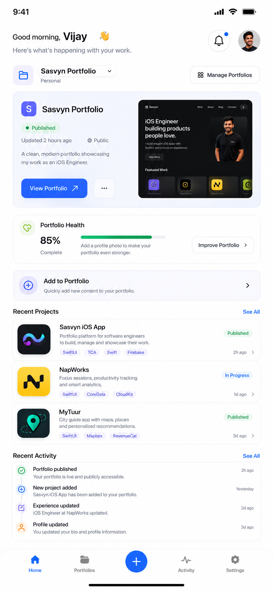
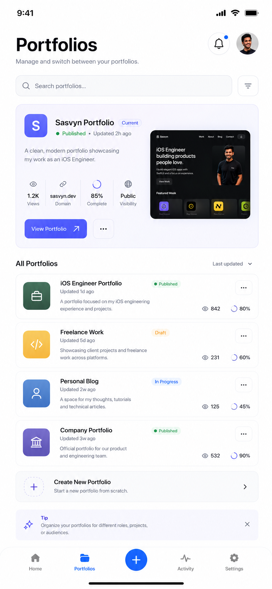
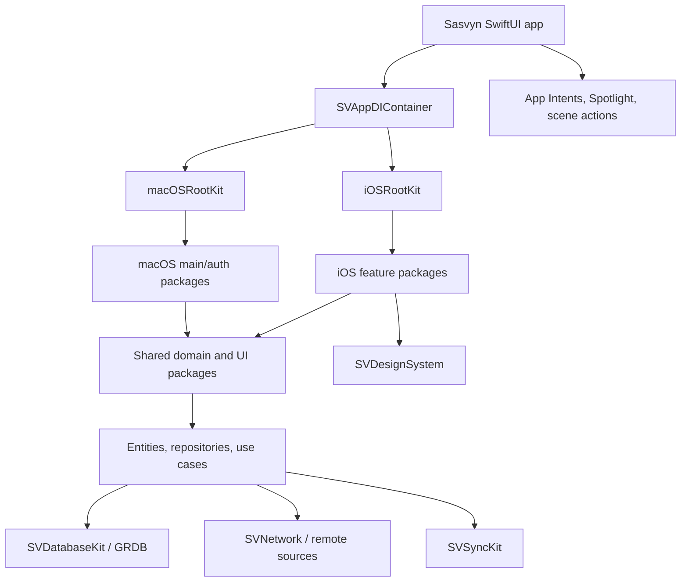

# Sasvyn

**A modular SwiftUI portfolio workspace for collecting, editing, and presenting professional work.**

Sasvyn brings portfolio content - projects, experience, education, skills, languages, documents, mockups, profile information, and social links - into an Apple-platform application. The repository is organized as a Swift Package Manager monorepo, with shared domain and infrastructure packages composed into iOS and macOS app roots.

> **Project maturity:** The repository contains substantial iOS features and reusable shared infrastructure. The macOS composition is present, but its authentication and feature surface are still scaffolding. Synchronization infrastructure exists, but not every local data domain is synchronized.

## Contents

- [Highlights](#highlights)
- [Design references](#design-references)
- [Product areas](#product-areas)
- [Architecture](#architecture)
- [Repository layout](#repository-layout)
- [Package catalog](#package-catalog)
- [Application lifecycle](#application-lifecycle)
- [Data, persistence, and sync](#data-persistence-and-sync)
- [Apple platform integrations](#apple-platform-integrations)
- [Requirements](#requirements)
- [Getting started](#getting-started)
- [Build and test](#build-and-test)
- [Fastlane](#fastlane)
- [Configuration and signing](#configuration-and-signing)
- [Current limitations](#current-limitations)
- [Contributing](#contributing)
- [License](#license)

## Highlights

- **Portfolio-focused:** Organize projects, work history, education, skills, languages, documents, mockups, profile details, and social links.
- **Native presentation:** SwiftUI application roots for iOS and macOS, with the current feature surface primarily implemented in iOS packages.
- **Modular by responsibility:** Shared domain and infrastructure packages are separated from platform-specific feature packages.
- **Local data first:** GRDB-backed persistence and package-owned file-storage helpers keep domain data and assets organized.
- **Sync foundations:** A reusable synchronization engine provides reconciliation, conflict resolution, retry policy, pending-change, and metadata abstractions.
- **System entry points:** iOS quick actions, App Intents/Shortcuts, and Core Spotlight can route into app features.

## Design references

The repository includes early visual explorations. These are design references, **not screenshots of the current application**, and some of the screens or controls shown may not be implemented.

<details>
<summary>View the portfolio dashboard and portfolio-list concepts</summary>

<p align="center">
  
  
</p>

</details>

## Product areas

| Area | Current capabilities |
| --- | --- |
| Home | Dashboard, recent projects, and portfolio creation entry points. |
| Portfolio | Portfolio presentation with project and experience sections. |
| Projects | Project overview, description, role, app information, screenshots, screenshot ordering, and technology stack. |
| Experience | Work history, responsibilities, dates, and edit forms. |
| Education | Education records, grades, lists, and forms. |
| Skills | Skills and categories, grouped presentation, add flows, and chips. |
| Languages | Language selection, proficiency, lists, cards, and edit forms. |
| Documents | Document categories, local files, document cards, and PDF previews. |
| Mockups | Device selection, image placement, presentation modes, previews, and export-related behavior. |
| Personal information | Profile details, name and birth-date editing, and profile-image handling. |
| Social links | Typed links and add/edit flows for common social and portfolio services. |
| Settings | Appearance preferences, tint selection, and personal-information destinations. |

## Architecture

The application uses **The Composable Architecture (TCA)** for feature state, actions, reducers, navigation, and dependency access. Shared packages own domain behavior and infrastructure; platform packages compose those capabilities into views and app flows.


```mermaid
flowchart TD
    App["Sasvyn SwiftUI app"] --> AppDI["SVAppDIContainer"]
    AppDI --> IOSRoot["iOSRootKit"]
    AppDI --> MacRoot["macOSRootKit"]
    IOSRoot --> IOSFeatures["iOS feature packages"]
    MacRoot --> MacFeatures["macOS main/auth packages"]
    IOSFeatures --> Shared["Shared domain and UI packages"]
    MacFeatures --> Shared
    Shared --> Domain["Entities, repositories, use cases"]
    Domain --> Storage["SVDatabaseKit / GRDB"]
    Domain --> Network["SVNetwork / remote sources"]
    Domain --> Sync["SVSyncKit"]
    IOSFeatures --> Design["SVDesignSystem"]
    App --> System["App Intents, Spotlight, scene actions"]
```

### Typical package boundaries

Domain packages commonly group code by responsibility:

```text
Domain/
  Entities/       Domain value types
  Repositories/   Repository contracts
  UseCases/       Application operations
Data/
  Sources/        Local and/or remote data sources
  Repositories/   Repository implementations
  DTOs/           Network request and response models
  Endpoints/      HTTP endpoint definitions
Database/
  Records/        Persisted record types
  Mappers/        Record/domain conversion
  Migrations/     Schema creation and evolution
DI/
  Clients/        TCA dependency clients
  Containers/     Dependency registration and composition
Presentation/     Reusable views, where applicable
```

The exact folder set varies by package; not every module implements every layer. Swift Package manifests declare Swift tools version **6.4**. The app target itself currently sets Swift language version 5 and enables approachable concurrency/default main-actor isolation; individual packages may opt into Swift 6 language mode.

## Repository layout

```text
.
|-- Designs/                          Early visual explorations
|-- Sasvyn.xcodeproj/                 Xcode project and shared scheme
|   \-- xcshareddata/xcschemes/       Shared Sasvyn scheme
|-- Sasvyn/
|   |-- App/                          SwiftUI, app delegate, and scene delegate
|   |-- Assets.xcassets/              App-level assets
|   |-- Modules/                      Shared domain, infrastructure, and UI packages
|   |-- iOS/                          iOS feature and composition packages
|   \-- macOS/                        macOS root, main, and auth packages
|-- SasvynTests/                      Xcode unit-test target
|-- SasvynUITests/                    Xcode UI-test target
|-- SasvynShareExtension/             Share-extension localization scaffold
|-- fastlane/                         Simulator and iPhone build lanes
|-- Gemfile                           Fastlane dependency
|-- ExportOptions.plist               Development export settings
|-- LICENSE                           MIT License
\-- README.md
```

The Xcode project currently defines the `Sasvyn`, `SasvynTests`, and `SasvynUITests` targets. `SasvynShareExtension` is a localization scaffold, not a configured Xcode target. Shared Swift package pins are stored under `Sasvyn.xcodeproj/project.xcworkspace/xcshareddata/swiftpm/Package.resolved`.

## Package catalog

There are currently **22 shared packages**, **18 iOS packages**, and **3 macOS packages**.

### Shared packages - `Sasvyn/Modules`

| Package | Responsibility |
| --- | --- |
| `AuthKit` | Apple Sign In authentication, auth session state, repository, client, and use cases. |
| `SVAboutKit` | About/profile content, local persistence, repository, migration, and use cases. |
| `SVDatabaseKit` | GRDB-backed database abstraction, migrations, records, CRUD, filtering, sorting, and observation. |
| `SVDesignSystem` | Shared SwiftUI controls, visual primitives, colors, fonts, symbols, spacing, and empty states. |
| `SVDIInfra` | App-level dependency composition and database/network/domain container wiring. |
| `SVDocumentKit` | Document entities/categories, local file storage, persistence, and document use cases. |
| `SVEducationKit` | Education records, grade types, persistence, repository, and CRUD use cases. |
| `SVExperienceKit` | Work experience and responsibilities, persistence, repository, and CRUD use cases. |
| `SVFoundation` | Shared extensions, date formats, file-storage helpers, property wrappers, and quick-action types. |
| `SVHomeKit` | Shared home-domain support and repository abstractions. |
| `SVLanguageKit` | Language/proficiency models, bundled language data, persistence, repository, and language use cases. |
| `SVMockupKit` | Mockup/device models, image storage, Photos integration, rendering modes, preview UI, and export support. |
| `SVNetwork` | HTTP environment resolution, auth/token wiring, refresh and upload support, DTOs, and network status. |
| `SVPersonalInformationKit` | User profile domain, local/remote sources, endpoints, persistence, image handling, and sync metadata integration. |
| `SVPortfolioKit` | Reusable portfolio cards and chip presentation components. |
| `SVProjectKit` | Projects, categories, screenshots, skills, persistence, storage, migrations, and use cases. |
| `SVRemoteImage` | SwiftUI remote-image loading and caching abstraction. |
| `SVShortcutsKit` | App Shortcuts provider and project/mockup creation intents. |
| `SVSkillsKit` | Skills, categories, grouped models, persistence, migrations, and use cases. |
| `SVSocialLinkKit` | Social-link models/types, persistence, repository, CRUD use cases, and service icons. |
| `SVSpotlightKit` | Spotlight items/destinations, indexing client, and destination mapping. |
| `SVSyncKit` | Generic sync engine, local/remote store contracts, metadata, pending changes, conflict resolution, and retries. |

### iOS packages - `Sasvyn/iOS`

| Package | Responsibility |
| --- | --- |
| `iOSAboutKit` | About screen and editable profile content. |
| `iOSAppearanceKit` | Appearance mode and tint selection. |
| `iOSAuthKit` | Sign-in feature and authentication screen. |
| `iOSDocumentsKit` | Document list, categories, cards, and PDF thumbnail views. |
| `iOSEducationKit` | Education list, cards, and forms. |
| `iOSExperienceKit` | Experience list, cards, and forms. |
| `iOSHomeKit` | Dashboard, recent projects, and quick-action entry points. |
| `iOSLanguageKit` | Language list, picker, cards, and forms. |
| `iOSLibraryKit` | Library destinations aggregating profile and portfolio-related areas. |
| `iOSMainKit` | Main tab and navigation composition. |
| `iOSMockupKit` | Mockup list, creation, device picker, and presentation modes. |
| `iOSPersonalInformationKit` | Personal-information screen and profile editors. |
| `iOSPortfolioKit` | Portfolio root, project/experience sections, and featured cards. |
| `iOSProjectKit` | Project list and project editing flows. |
| `iOSRootKit` | iOS root feature, dependency container, and auth/main-flow switching. |
| `iOSSettingsKit` | Settings root and destinations. |
| `iOSSkillsKit` | Skills list, add flow, modes, and chips. |
| `iOSSocialLinkKit` | Social-link list and add/edit forms. |

### macOS packages - `Sasvyn/macOS`

| Package | Responsibility |
| --- | --- |
| `macOSAuthKit` | macOS authentication package scaffold. |
| `macOSMainKit` | macOS main feature and view. |
| `macOSRootKit` | macOS root feature, dependency composition, and main-flow assembly. |

## Application lifecycle

The entry point is [`SasvynApp.swift`](Sasvyn/App/SasvynApp.swift).

1. `SasvynApp` creates the shared `SVAppDIContainer`.
2. Compile-time platform selection constructs `iOSRootDIContainer` or `macOSRootDIContainer`.
3. The selected root container creates the initial view and feature hierarchy.
4. The root container is exposed to the app delegate for supported external actions.
5. The SwiftUI window is configured with a default size of 1200 x 800 and content-driven minimum sizing.

On iOS, [`SceneDelegate.swift`](Sasvyn/App/SceneDelegate.swift) receives quick actions, Spotlight activities, and App Intents, then dispatches recognized actions into the root feature. Unknown quick-action identifiers are ignored.

## Data, persistence, and sync

`SVDatabaseKit` provides the shared persistence abstraction over GRDB. Domain packages own their records and migrations, map persisted values to domain entities, and expose operations through repository/use-case and TCA dependency layers. Local documents, project screenshots, profile images, and mockup assets use file-storage helpers rather than being treated as ordinary database values.

`SVSyncKit` defines reusable synchronization contracts:

- `SyncableEntity` supplies an entity identity, sync version, and update timestamp.
- `SyncLocalStore` and `SyncRemoteStore` abstract local and remote operations.
- `DefaultSyncEngine` reconciles local and remote state, coordinates per-entity requests, and supports bulk and pending-change synchronization.
- `SyncConflictResolver` decides how conflicting versions are resolved.
- `SyncRetryPolicy`, `SyncRetryStrategy`, and `SyncSleeper` control retry classification and backoff.
- `SyncMissingRemoteStrategy`, `SyncMetadataStore`, and sync-state types handle missing entities and persisted sync status.
- Operation IDs and pending-change context support idempotent retries.

Personal information is the most complete feature-level integration of local and remote profile data with synchronization metadata. The engine is reusable, but it should not be assumed that every domain package currently syncs.

## Apple platform integrations

### Quick actions

The current iOS `Info.plist` declares two home-screen quick actions: **New Project** and **Create Mockup**. Scene handling maps known action identifiers to root actions.

### App Intents and Shortcuts

`SVShortcutsKit` declares project-creation and mockup-creation intents and exposes them through an App Shortcuts provider. Scene launch and active-scene handling route the recognized intents to the same root action system.

### Core Spotlight

`SVSpotlightKit` defines searchable items and destinations. Spotlight activities are decoded by the iOS scene delegate and dispatched to the root feature for navigation.

### Appearance and media

The iOS appearance feature provides appearance and tint choices. Photo-library access is declared for selecting images for mockups and profile pictures. The app also includes device mockup assets and shared image/viewer components.

## Requirements

- A macOS development machine with Xcode and Apple-platform SDKs compatible with the project.
- Swift tools version **6.4** for the package manifests.
- iOS **26** and macOS **26** deployment support for the app/shared package configurations.
- The Xcode test targets currently specify deployment targets of **27.0**; an eligible newer simulator/runtime may be needed to run those targets.
- Ruby and Bundler are needed only for the Fastlane workflows.
- A configured Apple development team and signing setup are needed for signed device builds.

The app target currently supports iOS, iOS Simulator, and macOS in the Xcode project. Its current iOS device family is iPhone (`TARGETED_DEVICE_FAMILY = 1`); do not infer iPad support from the presence of iOS packages alone.

## Getting started

```bash
git clone https://github.com/thakur-vijay/sasvyn.git
cd sasvyn
open Sasvyn.xcodeproj
```

In Xcode:

1. Select the shared **Sasvyn** scheme.
2. Select an installed iOS Simulator, eligible iOS device, or macOS destination.
3. Let Xcode resolve the Swift packages.
4. For device runs, select a development team in Signing & Capabilities.

The local packages are declared through the Xcode project and their own manifests. For a package-level change, run package commands from that package directory; for app integration, build from the root Xcode project.

## Build and test

### Discover destinations

```bash
xcodebuild \
  -project Sasvyn.xcodeproj \
  -scheme Sasvyn \
  -showdestinations
```

### Build the app

Replace the example simulator with one reported by `-showdestinations`:

```bash
xcodebuild \
  -project Sasvyn.xcodeproj \
  -scheme Sasvyn \
  -destination 'platform=iOS Simulator,name=iPhone 14 Plus' \
  build
```

For a macOS build, use `-destination 'platform=macOS'`. A device build requires valid signing credentials:

```bash
xcodebuild \
  -project Sasvyn.xcodeproj \
  -scheme Sasvyn \
  -destination 'generic/platform=iOS' \
  build
```

### Run Xcode tests

The shared scheme includes `SasvynTests` and `SasvynUITests`. Choose a simulator compatible with the test targets' current deployment target:

```bash
xcodebuild \
  -project Sasvyn.xcodeproj \
  -scheme Sasvyn \
  -destination 'platform=iOS Simulator,name=iPhone 14 Plus' \
  test
```

### Run a package test suite

```bash
cd Sasvyn/Modules/SVSyncKit
swift test
```

The same command works in other package directories that declare tests, for example `Sasvyn/Modules/SVExperienceKit`.

### Test coverage notes

- `SVSyncKit` has focused tests for server-newer downloads, local-newer uploads, same-version conflict resolution, pending local changes, duplicate-request suppression, retries, and missing remote entities.
- `SVExperienceKit` tests that a currently active experience clears its end date.
- The app unit-test file and UI-test file are still Xcode-generated scaffolding; they do not yet provide broad product behavior coverage. Several package test targets are also placeholders.

## Fastlane

The root `Gemfile` declares Fastlane. Install it and run one of the build-only lanes:

```bash
bundle install
bundle exec fastlane ios simulator
bundle exec fastlane ios iphone
```

`simulator` cleans and builds using the configured **iPhone 14 Plus** simulator destination. `iphone` cleans and builds for `generic/platform=iOS`. These lanes do not archive, distribute, or upload a release. [`ExportOptions.plist`](ExportOptions.plist) currently describes a development export.

## Configuration and signing

| Path | Purpose |
| --- | --- |
| `Sasvyn/Info.plist` | App metadata and the two declared iOS home-screen quick actions. |
| `Sasvyn/Sasvyn.entitlements` | Apple Sign In entitlement. |
| `Sasvyn.xcodeproj/project.pbxproj` | App/test targets, package products, deployment settings, and signing settings. |
| `Sasvyn.xcodeproj/xcshareddata/xcschemes/Sasvyn.xcscheme` | Shared build, launch, and test scheme. |
| `Sasvyn.xcodeproj/project.xcworkspace/xcshareddata/swiftpm/Package.resolved` | Resolved Swift package versions. |
| `Gemfile` | Ruby dependency declaration for Fastlane. |
| `fastlane/Appfile` | Fastlane app identity settings. |
| `fastlane/Fastfile` | Simulator and generic iPhone build lanes. |
| `ExportOptions.plist` | Development export configuration. |

The app target currently uses automatic signing and a project-configured development team. The configured app bundle identifier is `com.artist.yattsTest`; review both values and select your own team/identifier before using the project in another Apple Developer account. Do not commit personal credentials, private tokens, provisioning profiles, or machine-specific signing material.

The network container currently selects the development environment in code. The environment resolver maps the declared environment cases to the same configured API base URL today; treat staging/production separation as unfinished until that configuration is deliberately changed and verified.

## Current limitations

- The macOS root/main packages exist, but `macOSAuthKit` is a scaffold and the macOS feature surface is not equivalent to iOS.
- `SasvynShareExtension` contains localization scaffolding only; it is not an Xcode target.
- Most product data is persisted locally; a generic sync engine does not mean every repository synchronizes remotely.
- Broad app and UI behavior test coverage is still in progress.
- App/test deployment settings differ: the app is set to iOS/macOS 26, while Xcode test targets are set to 27.0.
- The development, staging, production, and custom network enum cases do not currently resolve to separate API hosts.

## Contributing

When adding or changing a domain feature:

1. Keep domain entities, repository contracts, and use cases in the relevant shared package under `Sasvyn/Modules`.
2. Implement local/remote sources, DTOs, records, migrations, and mapping in the owning package as needed.
3. Register dependencies through the package client/container and app-level composition.
4. Put platform-specific reducers, views, and navigation in `Sasvyn/iOS` or `Sasvyn/macOS`.
5. Add focused package tests for domain and persistence behavior; add app/UI coverage for user-visible workflows.
6. Update this README when package responsibilities, platform support, setup, or automation change.

Keep changes scoped to the package that owns the behavior and verify them with that package's tests plus an app build when integration is affected.

## License

Sasvyn is distributed under the [MIT License](LICENSE).
